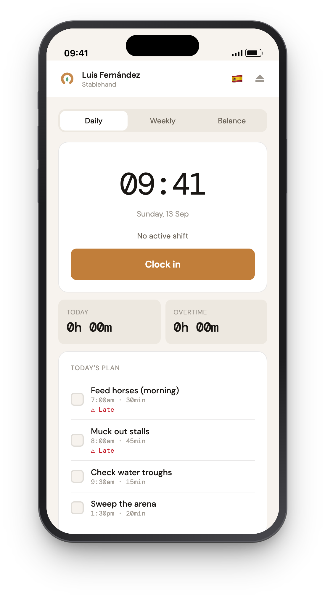
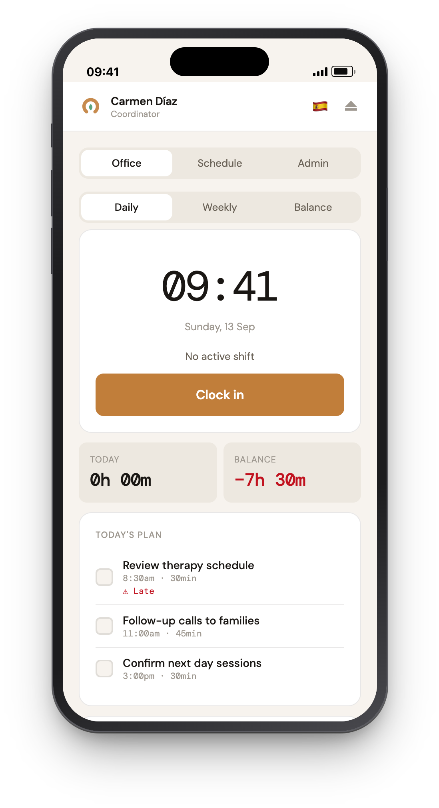
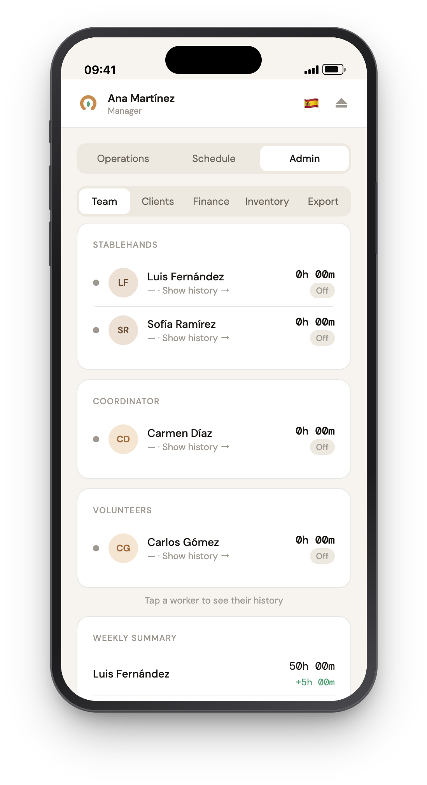
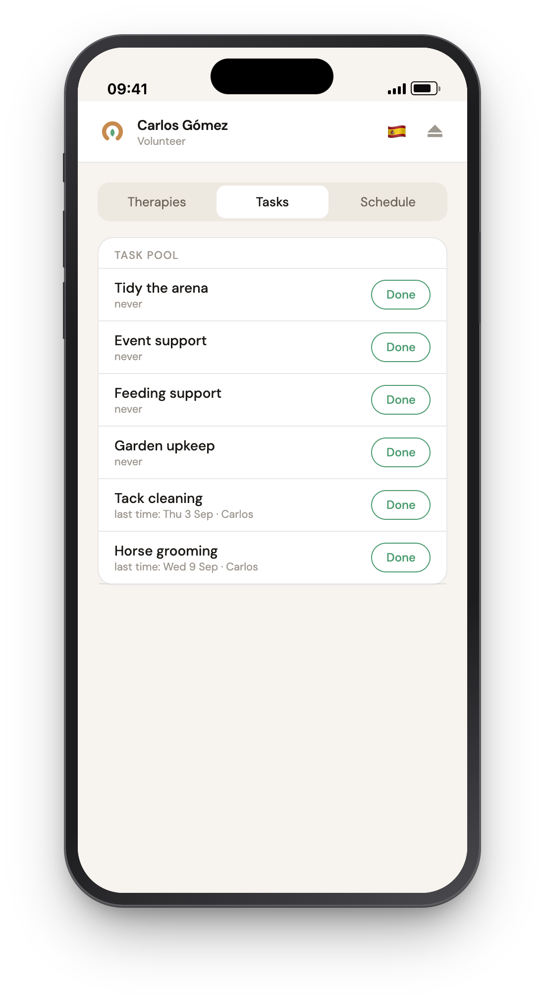
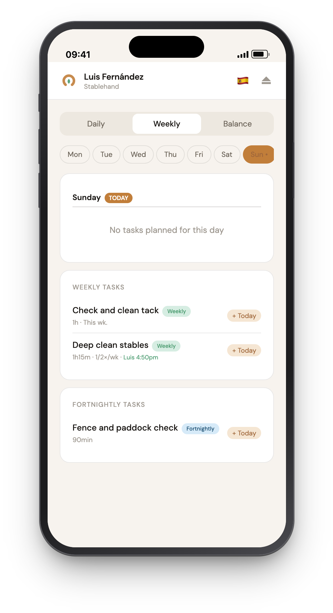
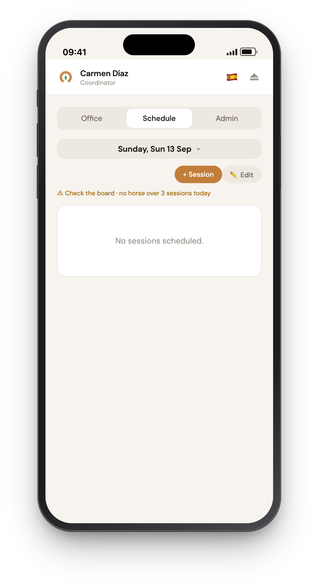
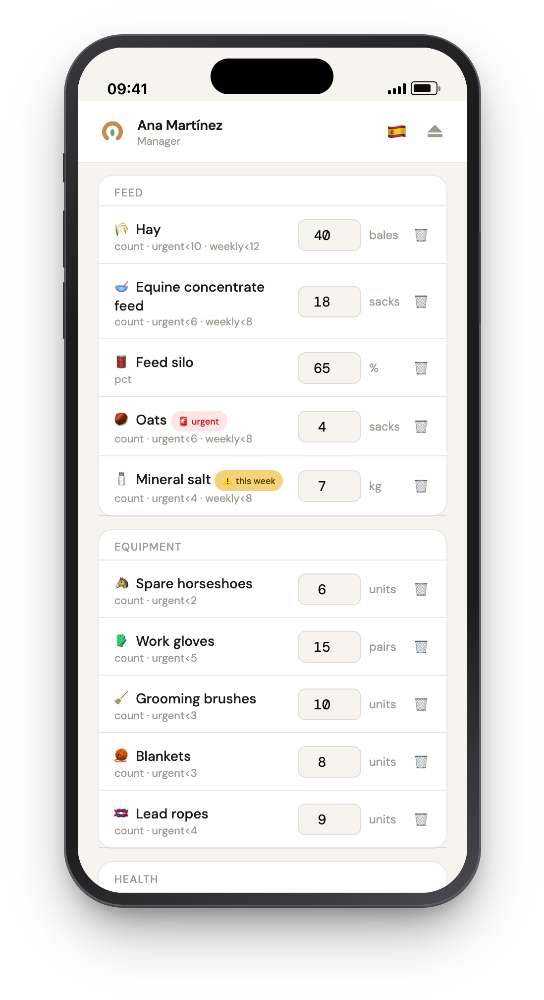
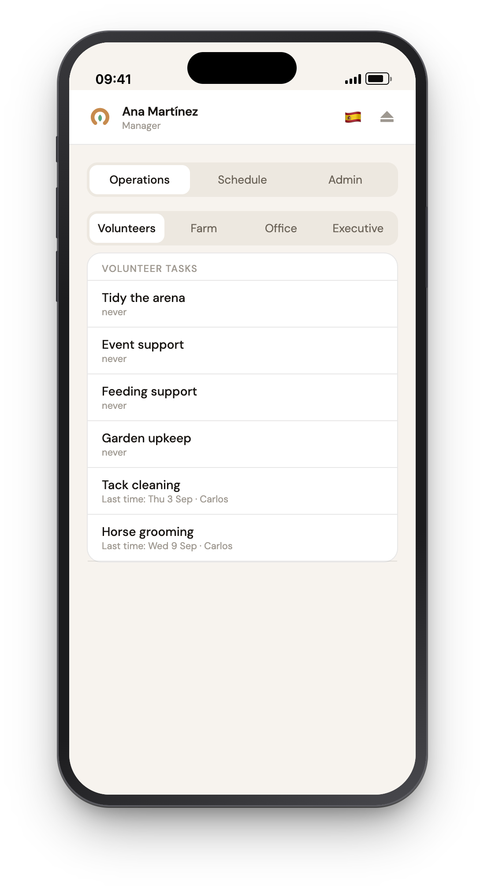
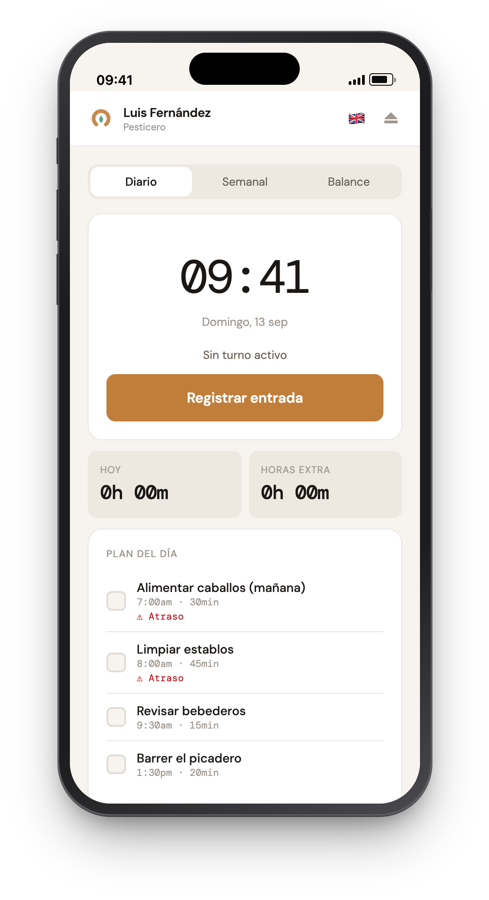
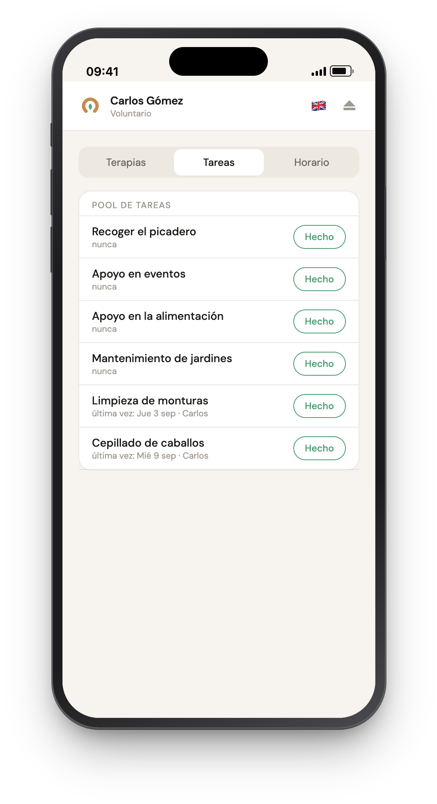

# Equinoterapia Vista Verde — Management App (Demo)

Operations app for an equine-assisted therapy centre: therapy scheduling, staff time
tracking, recurring task management, volunteer coordination and inventory — built as a
mobile-first single-page app on top of Supabase.

**This is a public demo build.** The application was built for a real therapy centre, but
this version runs against its own isolated Supabase project under a fictional brand and
contains **only fictional data** — no real clients, staff, diagnoses or contact details.

🔗 **Live demo:** https://equinoterapia-vista-verde.netlify.app

## Demo logins

The app renders four different interfaces depending on the signed-in user's role, so
each login shows a genuinely different application. Password for all accounts:
`VistaVerde2026!`

| Role | Login | What you see |
|---|---|---|
| `colaborador` | `ana.admin@vistaverde-demo.com` | Full management view: team, agenda, payroll, admin |
| `coordinador` | `carmen.coord@vistaverde-demo.com` | Office view: therapy agenda, office tasks, finances |
| `pesticero` | `luis.pesticero@vistaverde-demo.com` | Daily farm view: own task list, clock-in, overtime balance |
| `volunteer` | `carlos.voluntario@vistaverde-demo.com` | Volunteer view: task pool, own hours |

## Screenshots

<table>
  <tr>
    <td align="center"><br><sub><b>Stablehand</b> · Daily plan</sub></td>
    <td align="center"><br><sub><b>Coordinator</b> · Office day</sub></td>
    <td align="center"><br><sub><b>Manager</b> · Team hours</sub></td>
    <td align="center"><br><sub><b>Volunteer</b> · Task pool</sub></td>
  </tr>
  <tr>
    <td align="center"><br><sub><b>Stablehand</b> · Weekly plan</sub></td>
    <td align="center"><br><sub><b>Coordinator</b> · Therapy agenda</sub></td>
    <td align="center"><br><sub><b>Manager</b> · Inventory alerts</sub></td>
    <td align="center"><br><sub><b>Manager</b> · Volunteer tasks</sub></td>
  </tr>
</table>

Every role can switch the whole interface between English and Spanish, task and inventory
names included:

<table>
  <tr>
    <td align="center"> <br><sub><b>Stablehand</b> · English / Español</sub></td>
    <td align="center"> <br><sub><b>Volunteer</b> · English / Español</sub></td>
  </tr>
</table>

## Features

- **Therapy scheduling** — recurring weekly slots per client and horse, materialised into
  individual sessions with attendance and preparation tracking
- **Time tracking** — clock in/out with break handling, per-role daily targets, rolling
  overtime balance per pay period, and compensation requests (payout or time off)
- **Task management** — daily/weekly/biweekly/monthly cadences, per-person assignment,
  shared vs. individual completion, plus ad-hoc extra tasks and weekly planning
- **Client records** — public roster separated from private data (diagnosis, tutor,
  contact details) at the database level, enforced by row-level security
- **Inventory** — stock levels with thresholds and point-in-time snapshots
- **Bilingual UI** — every role can switch the whole interface between Spanish and
  English; the choice is stored per user in `profiles.language`. Dates and numbers follow
  the selected language. Task, volunteer-pool and inventory names carry their own English
  columns and switch along; anything typed into the app itself (notes, client records, a
  newly added extra task or stock item) stays as entered

## Tech stack

Vanilla JavaScript (no framework, no build step), Supabase (PostgreSQL, Auth, PostgREST),
CSS custom properties, deployed as static files on Netlify.

## Architecture notes

**Security is enforced in the database, not the client.** Every table has row-level
security enabled and all policies are scoped to the `authenticated` role, so the
publishable API key embedded in the client exposes nothing to anonymous visitors.
Privilege checks run through a `SECURITY DEFINER` helper:

```sql
create function public.my_role() returns text
language sql stable security definer as $$
  select role from public.profiles where id = auth.uid();
$$;
```

Policies then gate writes on `my_role() = any (array['colaborador','coordinador'])`,
while staff can always read their own rows (`user_id = auth.uid()`). Sensitive client
data lives in a separate `client_private` table that only privileged roles can read at
all — a role split that holds even if the frontend is bypassed entirely.

New accounts are provisioned by a trigger on `auth.users` that creates the matching
`profiles` row, so application state and auth state cannot drift apart.

## Running it yourself

1. Create a Supabase project
2. Run [`supabase/schema.sql`](supabase/schema.sql) — tables, RLS policies, functions, trigger
3. Create the auth users listed at the top of [`supabase/seed.sql`](supabase/seed.sql)
4. Run [`supabase/seed.sql`](supabase/seed.sql) — assigns roles and loads the fictional dataset
5. Point `SUPABASE_URL` / `SUPABASE_KEY` in [`app.js`](app.js) at your project
6. Serve the folder statically (`python3 -m http.server 8123`)

[`supabase/reset.sql`](supabase/reset.sql) wipes the seeded data if you need to start over.

## Refreshing the demo data

The seed generates every date relative to the moment it runs: therapy sessions span three
weeks back to one week ahead, the weekly plan is pinned to the current week, and time
entries cover the last 14 days. Left alone, the demo therefore drifts — after a couple of
weeks the agenda shows no upcoming sessions and the overtime balance for the current pay
period reads zero.

To re-anchor everything to today, run [`supabase/reset.sql`](supabase/reset.sql) followed
by [`supabase/seed.sql`](supabase/seed.sql) in the Supabase SQL editor. `reset.sql` clears
the demo data and keeps `public.profiles`, so the five accounts and their roles survive.

Do not reach for [`supabase/reset-full.sql`](supabase/reset-full.sql) for this. It also
truncates `public.profiles`, and nothing recreates those rows: they come from an auth
trigger that only fires on sign-up, and `seed.sql` only UPDATEs them. It is the script for
one specific situation — you deleted the auth users, so their old profiles rows are
orphaned — and it requires recreating the users before seeding. `seed.sql` refuses to run
when the profiles are missing rather than leaving you with a demo that loads but has no
names, roles or working login.

`seed.sql` is not idempotent and also refuses to run when the demo tables still hold data,
so always let `reset.sql` go first.

A database created before the bilingual content columns existed needs
[`supabase/migrate-content-i18n.sql`](supabase/migrate-content-i18n.sql) once. Fresh
installs do not: `schema.sql` declares the columns and `seed.sql` fills them.

## Differences from the production build

The clock-in is normally restricted by a 200 m geofence around the centre. This demo sets
`GEOFENCE_ENABLED = false` so the time tracking can be tried from anywhere, and the
coordinates in the source are fictional.
